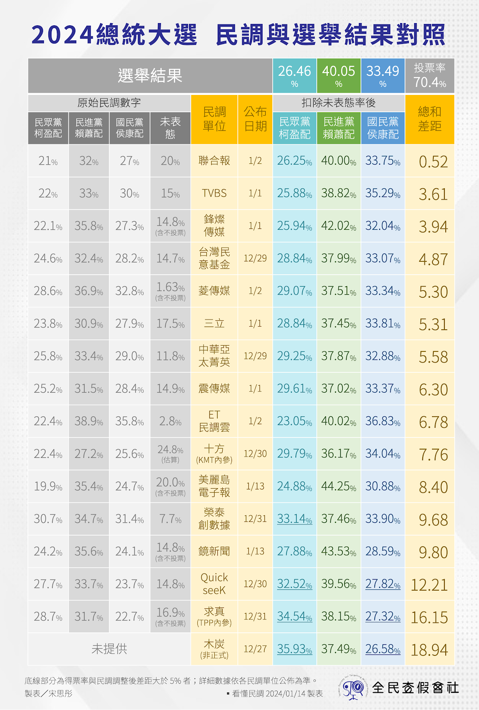
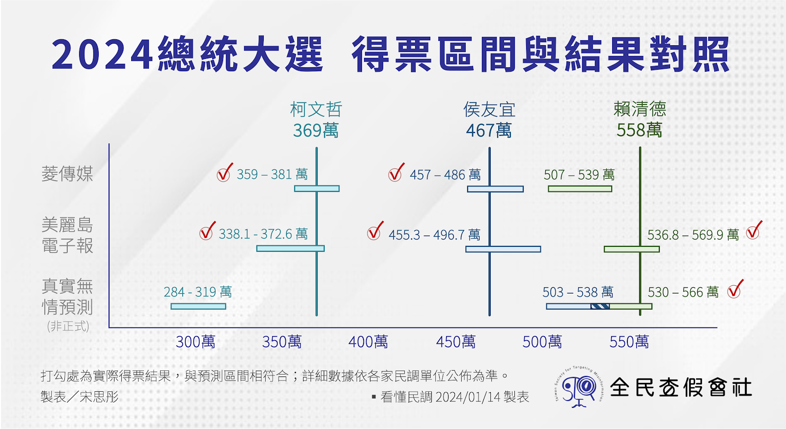
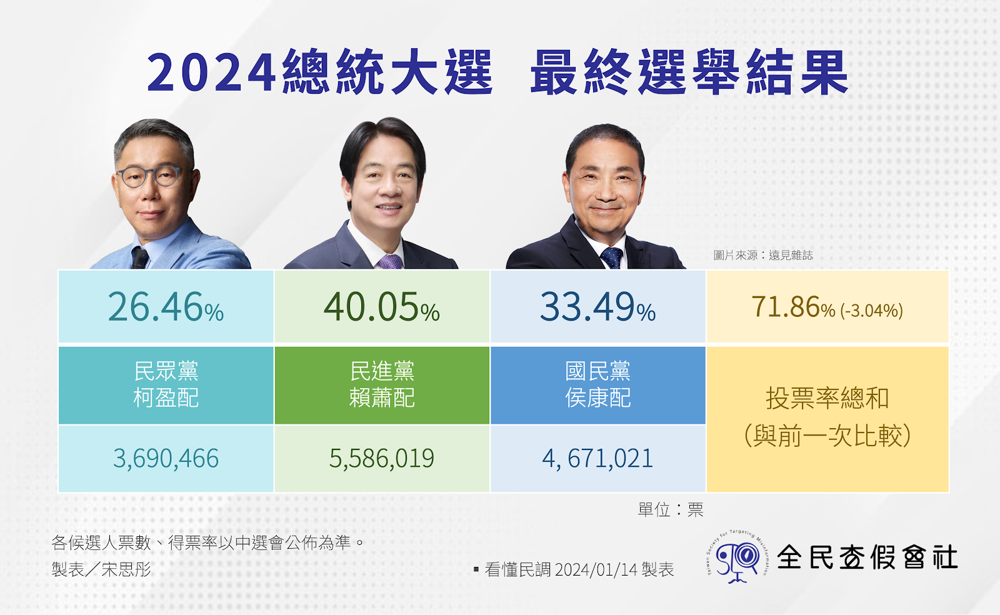
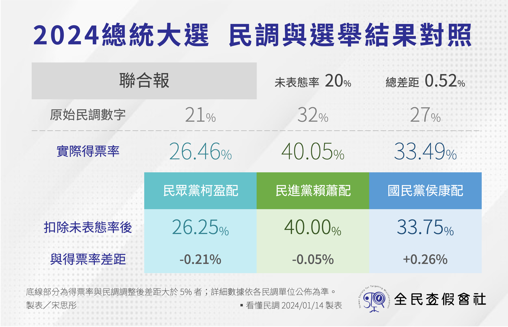
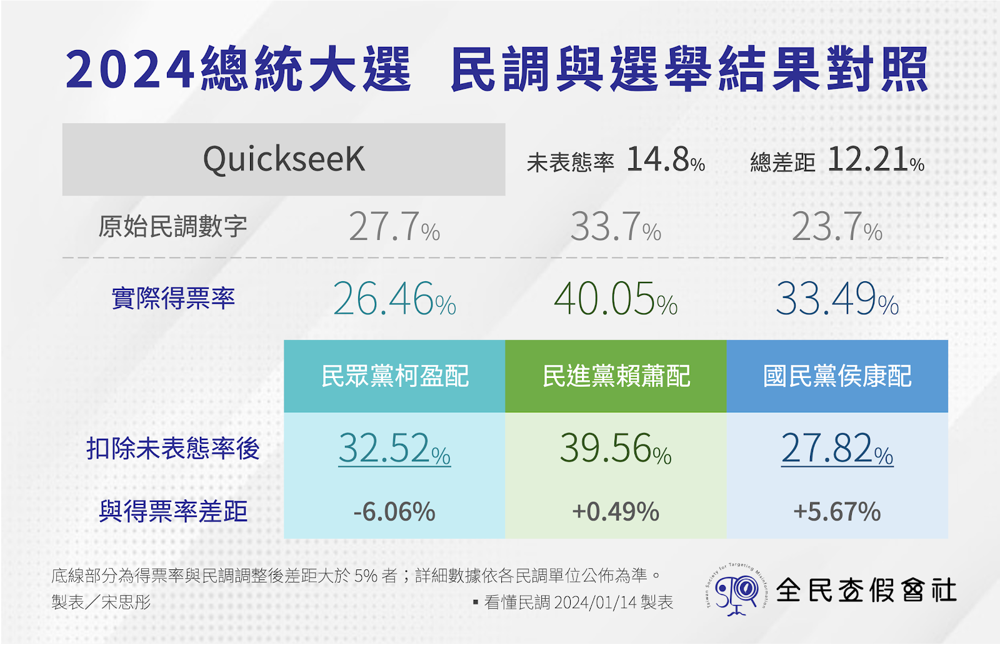
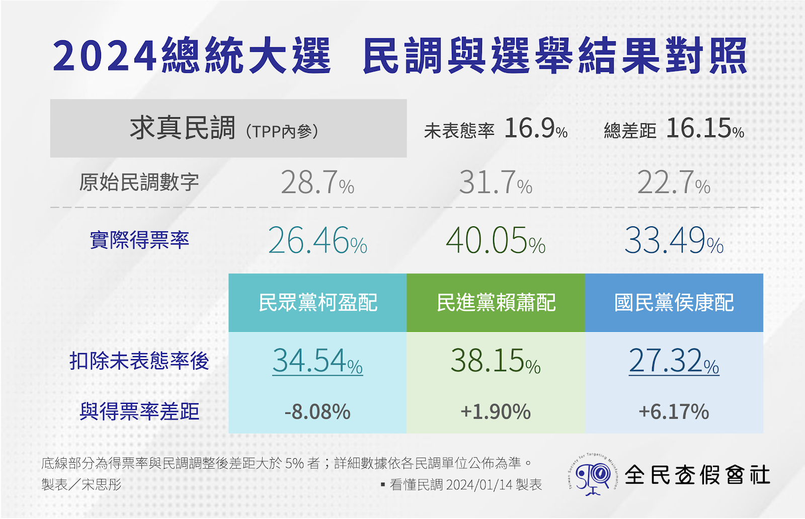

看懂民調》總統大選民調掀牌！聯合報僅差0.52%最準確　民眾黨內參差16.15%最多

2024 總統大選結果底定，最終賴清德以 558 萬票、40% 得票率，當選中華民國總統，民進黨進入第三任期。「看懂民調」專欄特別整理各家民調的單位數據，與選舉結果進行交叉比較分析。

總統大選結果底定，賴清德以 558 萬票、40% 的得票率，贏過侯友宜的 467 萬票（33.49%）、柯文哲的 369 萬票（26.46%），當選下一屆中華民國總統。賴清德成為繼 2000 年以來，在三腳督狀況之下，得票率並未過半的當選者。

▲ 2024 總統大選，最終選舉結果。（圖／宋思彤 製表）

回顧本屆總統選舉，諸多討論與民調有關，包括：抽樣誤差、手機市話抽樣、樣本加權、街頭民調等話題，顯見民意調查已被各方選民高度重視，更代表台灣已經朝向下一個理性、科學、務實的方向邁進。

「看懂民調」專欄曾在民調發布日截止前，統整[各家民調單位之封關數據](https://tstm.tw/Article/Detail/5288)。本文將進一步對比選舉得票率，進而分析各家民調之準確度異同。

## **16 組民調對照　越老牌越準確**

「看懂民調」特別整理 16 家民調（包括 1 組非正規民調）的支持度與得票數換算，上圖左方為原始民調數字、右方為扣除未表態（不知道、投廢票、不投票等）率之後，所呈現的可能得票率。其中，最右方的「總和差距」部分，則是將候選人的民調與實際得票率的相差數，並將柯、賴、侯三人相加後所得。

▲ 2024 總統大選民調與選舉結果對照。（圖／宋思彤 製表）

從圖表中可發現，長期有在製作民調的單位，在得票率的估計上較為準確。例如：《聯合報》的總和差距僅為 0.52%、TVBS 的總和差距為 3.61%、鋒燦民調（FTNN）的總和差距則為 3.94%。

民調結果雖呈現大小不一之差距，但大多數的候選人排名皆為正確，唯獨鏡新聞、QuickseeK、求真民調（民眾黨內參）三家民調單位，指出柯文哲會在選戰中奪得第二名，然而選舉結果並非如此。顯見上述單位的調查時的抽樣、加權等層面，可能需要更加精進。

綜合上述，「看懂民調」結果發現《聯合報》的數據僅差 0.52%，是預測最準確的民調；民眾黨內參的求真民調則相差 16.15%，是正規民調中，與選舉結果相差最大者。

## **得票區間預測　美麗島精準命中**

比起支持度或得票率，預測得票數會更加困難，原因在於投票當天可能有諸多因素（例如天氣等），會影響到選民的投票意願。本次選舉亦有三家民調單位，預測本次總統大選之可能得票數，分別為：《菱傳媒》、《美麗島電子報》與「真實無情的未來預測」網站（非正規民調）。

▲ 2024 總統大選，得票區間與選舉結果對照。（圖／宋思彤 製表）

《美麗島電子報》雖在支持度方面落差 8.4%，但該報於投票結束後公布之得票預計數字，是所有民調單位中，準確度最高者，其區間範圍精準，可稱完全命中。

《菱傳媒》部分，在柯文哲、侯友宜部分皆有命中，然而在賴清德部分低估其實際得票數字，差距達 50 萬之多，是選舉民調預測得票區間中，次要準確者。

民調網站「真實無情的未來預測」宣稱結合多家民調，並將其爬梳整理後，做出相關的得票數與當選機率預測。結果發現，柯文哲的得票數被低估、侯友宜的得票數被高估，唯有賴清德的得票數字預測正確，是其中準確度最低的單位。

[本系列下篇文章](https://tstm.tw/Article/Detail/5291)，將剖析在選前討論度極高的「重點民調公司」，並將其支持度、剔除未表態後數字，以及支持率三項並陳，討論其準確度與相關原因。

# 看懂民調》選後民調大檢驗！老牌機構精確　「柯老二」結果全數失準

賴清德成功當選總統，民進黨進入第三任期。「看懂民調」除整理 16 家民調與選舉結果的比對、整理外，也精選投票前討論、聲量極高的幾組「重點民調」，透過數字與趨勢的結合，解讀本次的民調準確情形。

賴清德以 558 萬票、40% 的得票率，成為新一任中華民國總統。選舉結束後，封關民調開盤，《聯合報》在選前所做的封關民調，與選舉結果僅差 0.52%，成為本次選舉的「最精準」民調。

****

▲ 2024 總統大選，最終選舉結果。（圖／宋思彤 製表）

「看懂民調」專欄曾在民調發布日截止前，統整各家民調單位之封關數據；[前篇也透過表格形式](https://tstm.tw/Article/Detail/5290)，呈現 16 組民調數據、得票區間與選舉結果之差距。

本文將以幾家在選前即被高度討論的「重點民調」為主題，來分析其民調呈現的支持度，以及其差距的異同。

## **聯合報、TVBS 「老牌」機構較精準**

****

▲ 2024 總統大選，《聯合報》民調與選舉結果對照。（圖／宋思彤 製表）

《聯合報》在 1 月 2 日公布之封關民調，指出柯盈配 21%、賴蕭配 32%，侯康配則為 27%，不知道、不投票之未表態率則是 20%。

「看懂民調」扣除未表態率後進行換算，侯友宜的支持度為 33.75%，與實際得票數相差 0.26%；柯文哲的支持度為 26.25%，與實際得票數相比僅差 0.21%；賴清德支持度為 40%，與實際數字更只有 0.05% 的落差。

3 組候選人進行相加後，總共僅有 0.52% 的落差，為 16 組民調中相差最少者。

▲ 2024 總統大選，TVBS 民調與選舉結果對照。（圖／宋思彤 製表）

TVBS 本身具有民調中心，因此發布民調不需委外，每次發布民調後，亦會於民調中心官網發布相關民調報告，並透過交叉分析與過往對照進行說明。

本次封關民調，TVBS 是於 1 月 1 日副手辯論後進行調查並發布，結果發現賴清德 33% 居冠、侯友宜 30% 居次，柯文哲則為 22% 再居次。未表態率為 15%。

「看懂民調」經過未表態率剔除換算後，侯友宜的支持度有 35.29%，與實際得票率相差約 1.80%；賴清德為 38.82%，相差 1.23%；最低的則是柯文哲，支持度 25.88%，相差僅有 0.58%。

3 組候選人進行相加後，總共僅有 3.61% 的落差，為 16 組民調中相差次少者。

## **求真、QuickseeK 異軍突起　民調結果有差距**

在民調界相對年輕的兩大單位：求真民調、QuickseeK，在民調結果上呈現名次與百分比的大幅度差距。

▲ 2024 總統大選，QuickseeK 民調與選舉結果對照。（圖／宋思彤 製表）

QuickseeK 民調號稱「快析輿情資料庫」，在民調搜集上利用手機、市話的雙底冊方式進行。12 月 30 日調查指出，賴清德 33.7% 領先，第二名則是柯文哲的 27.7%，第三名則是侯友宜的 23.7%。未表態率為 14.8%。

「看懂民調」將未表態率剔除後，賴清德的支持度為 39.56%，與實際得票率相差 0.49%；但侯友宜的民調為 27.82%，與得票率相差 5.67%；柯文哲 32.52%，更相差 6.06%。

經過計算，本民調的差距總和為 12.21%，是所有公開發布民調中，差距最大者。

▲ 2024 總統大選，求真民調與選舉結果對照。（圖／宋思彤 製表）

相差最多者，則為民眾黨的內參民調（由求真民調執行），該份民眾指出，賴清德與柯文哲只相差不到 4 個百分點，侯友宜則為三組候選人中最低者。

在扣除未表態率後，賴清德為 38.15%，與實際得票率相差 1.90%，但侯友宜 27.32%，與實際狀況相差 6.17%，柯文哲 34.54%，更與得票率相差超過 8 個百分點，達到 8.08%，是所有民調中單一候選人相差最多者。

雖其為民眾黨內參民調，參考價值有限，但國民黨的內參民調（由十方民調執行），差距僅有 7.76%，且三位候選人的排名順序正確，反而相對較具有參考價值。

## **網路問卷、街頭民調　結果大不同**

在本次選舉中頗具話題性的民調，莫過於網路方法與街頭民調，並引發熱烈話題。本段將以《菱傳媒》與「木炭民調」為例，透過與實際得票率之對比，進行交叉分析與討論。

▲ 2024 總統大選，《菱傳媒》民調與選舉結果對照。（圖／宋思彤 製表）

《菱傳媒》採用網路主動發放問卷調查方式，並針對使用者的性別等的準確性，採用網路行為和資料庫標籤比對。不只是新生代的網路原生媒體，更曾在 2022 年九合一大選精準預測支持度，並打響名號。

本次總統大選民調，《菱傳媒》在封關民調中指出，賴清德以 36.9% 領先、侯友宜 32.8% 緊追在後，柯文哲 28.6% 居次，另有 1.63% 民眾未表態。

「看懂民調」進行換算後，最為精準的為侯友宜的 33.34%，僅與實際得票率相差 0.15%；賴清德為 37.51%，相差 2.54%；柯文哲則有 29.07%，相差 2.61%。三組候選人的總和相差約為 5.3%。

▲ 2024 總統大選，「木炭民調」與選舉結果對照。（圖／宋思彤 製表）

「木炭民調」為 YouTube 街頭訪問型民調，透過不同地點、不同年齡層的詢問、探查，並宣稱進行加權數字過後，得到的相關支持度。該份民調受到特定支持者喜愛，柯文哲亦曾接受該頻道訪談並公開提及。

該份民調並未提供未表態率數字，經過「看懂民調」直接比對後，侯友宜相差 6.91%、柯文哲更相差近 10 個百分點，為 9.47%。是所有表格民調中相差最大者。

近幾次選舉對於街頭民調的討論從未停歇，然而街頭民調對於政治低涉入者、消極表態者都無法準確進行調查，因此在民調呈現的數字中會呈現極大差距。